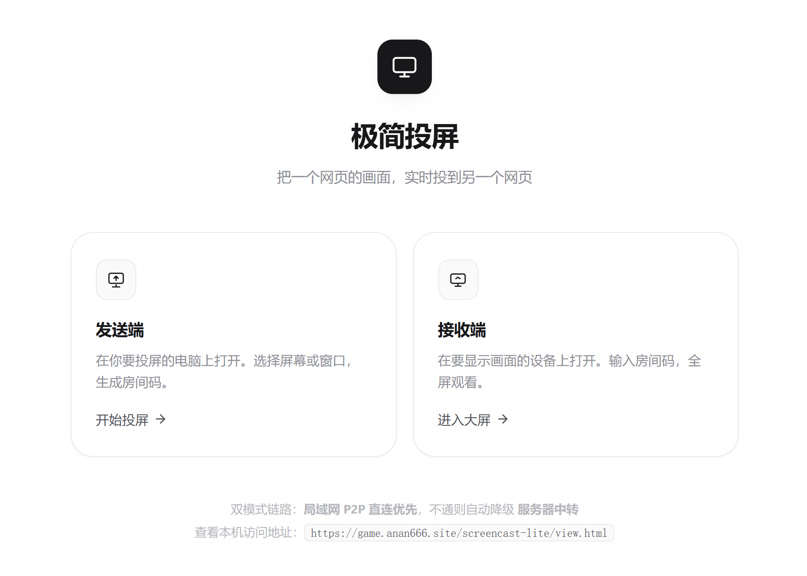

[English](README.md) | [简体中文](README_Simplified_Chinese.md) | [繁體中文](README_Classical_Chinese.md)

# 極簡投屏 · Screencast Lite

以一網頁之畫面，實時投射於另一網頁。**純白極簡之風**，局域網內 P2P 直連為先，弗通則自動降級，經伺服器中轉。

## 速啟

```bash
cd screencast
npm install          # 運行依賴惟 ws（WebSocket 服務端）
node server/server.js
```

> **用 pnpm 乎？** 倉庫內 `pnpm-lock.yaml` 並鎖運行依賴 `ws` 與開發依賴 `puppeteer-core`（後者供瀏覽器用例，非必需），故 `pnpm install --frozen-lockfile` 與 `pnpm install` 皆可直接用。若惟欲運行依賴、略過 `puppeteer-core`，用 `pnpm install --prod` 可矣。
>
> **用 npm 乎？** 全然忽略 `pnpm-lock.yaml`：`npm install` 惟裝 `dependencies` 之 `ws`，`npm i -D puppeteer-core` 方裝測試用之瀏覽器驅動。

啟動後，終端印出可用地址：

```
本機控制台   http://localhost:8080/cast
本機大屏     http://localhost:8080/view
局域網大屏   http://192.168.x.x:8080/view
```

**用法**：欲投屏之電腦開 `/cast` → 點「選擇屏幕並開始投屏」→ 大屏設備開 `/view` → 輸入 4 位房間碼（或直掃二維碼）。

## 技術棧

| 環節 | 方案 |
|---|---|
| 屏幕採集 | `getDisplayMedia()` — 可選整個屏幕 / 單一窗口 / 瀏覽器標籤頁 |
| 點對點傳輸 | **WebRTC** `RTCPeerConnection` — 局域網內直連，延遲最低 |
| 信令通道 | **WebSocket** — 房間碼配對、SDP/ICE 交換、斷線自動重連 |
| NAT 穿透 | **STUN**（Google / Cloudflare 公共節點）+ 可選 **TURN** |
| 自動選路 | P2P 直連為先 → 不通則自動降級 **伺服器中轉** |

## 雙模式鏈路

```
                   ┌─ 局域網 P2P 直連（優先，延遲最低）
發送端 ──── 協商 ───┤
                   └─ 伺服器中轉（P2P 不通時自動降級）
```

### 直連模式（默認）

同一局域網內兩端直接點對點傳視頻流，不經伺服器。發送端頁面顯示「**P2P 直連**」或「**局域網直連**」。

### 中轉模式（自動兜底）

三種情形會自動切至中轉，**無需手動操作**：

1. **P2P 協商超時** — 6.5 秒內未連上
2. **ICE 協商失敗** — `connectionState` 變為 `failed`（立即切，不等待）
3. **畫面靜默中斷** — 連接看似正常然已不出幀（關鍵兜底，見下）

`connectionState` 變為 `disconnected` 時**不會**立即降級 —— 此乃可恢復之瞬時狀態，予以 3 秒寬限期，期間恢復則續走 P2P。惟 3 秒後仍為 `disconnected` 方切中轉。

中轉模式下，發送端以 `MediaRecorder` 將畫面編為 WebM 分片，經 WebSocket 二進制幀由伺服器轉發，接收端以 `MediaSource` 邊收邊播（自動追幀以壓低延遲）。

> **中繼模式之 HUD**：此鏈路無 `RTCPeerConnection`，`getStats()` 無所取。故分辨率與幀率改由 `<video>` 元素本地採集（`videoWidth/videoHeight`、`getVideoPlaybackQuality().totalVideoFrames` 差分）；**RTT 無從觀測，恆顯示「—」** —— 中轉本無可測之鏈路往返時延，此為誠實之結果，非缺失。

> **多屏共享編碼器**：無論接幾塊大屏，中轉惟用**一個** `MediaRecorder`。分片按 8 字節 `viewerId` 前綴於服務端定向轉發至對應大屏 —— 8 塊屏亦惟跑一份 VP8/VP9 編碼，不致出現 8 個編碼器同時焚 CPU 之狀。

### 大屏與發送端的斷線行為

分兩條路徑，視主機「**暫離**」抑「**真終**」而定。

**路徑甲：暫離（刷新頁面 / 信令抖動）—— 優雅重連**

發送端斷開前發一 `host-away`，服務端據此**不立即毀房間**，入 15 秒優雅窗口：

```
發送端 ws 斷開
   │
   ├─ 有 host-away 標記 → 房間保留 15s，大屏橫幅「發送端連接波動，正在恢復…」
   │      ├─ 窗口內主機以同碼重連 → 廣播 host-return → 大屏「已恢復」，無感續播
   │      └─ 超時仍未歸 → destroyRoom('主機重連超時') → 大屏回待機
   │
   └─ 無標記（拔網線、切網絡等不及通知）→ 立即 destroyRoom → 大屏回待機並自動重試
```

**關鍵**：房間保留 ≠ 連接仍活。主機重載後舊 `RTCPeerConnection` 已廢，而其 `connectionState` 或長時間停於 `connected`（對端消失後 ICE 需數十秒方判失敗）。此時 `vx.mode` 仍顯示 `p2p-host` 看似一切正常，然 `video.currentTime` 早已定格。

故大屏得「是否重建」之決時，**按信號強弱分路**，而非一刀切：

| 觸發信號 | 強度 | 處置 |
|---|---|---|
| `host-return` | **強**（主機明告其方 `create(reused)` 過，舊 pc 必已廢） | `scheduleRejoin(true)` —— 延遲 0、**無條件**重建，不做任何健康判定 |
| 已處 `relay` / `relay-blob` | **反向信號**（主機主動切來） | 直接撤銷，**絕不**重建 P2P |
| `connectionState → failed` | 弱（或僅瞬時抖動） | `scheduleRejoin(false)` —— 退避延遲，再以 `isPictureAlive()` 二次確認 |

**緣何中繼模式必單獨攔一道**：切中繼乃主機側之主動決斷（`pc failed → enableRelay → relay-begin`）。若大屏此時重走 P2P，主機將 `removeViewer → relayViewers 清空 → sharedRecorder.stop()`，把剛建好之中繼鏈路**親手拆毀**；然後新 pc 大抵又敗、又切中繼、又發 `relay-begin` —— 雙方陷入「切中繼 → 大屏重建 P2P → 又敗 → 又切中繼」之振盪，用戶見畫面每隔數十秒中斷一次。

此判斷必置於**調用方**（`scheduleRejoin`），不可塞入 `isPictureAlive()`。後者之語義為「P2P 畫面是否在動」，而中繼模式下畫面自然在動（惟數據源非 WebRTC）。令其返 `false` 等於撒謊，調用方將據此推翻中繼鏈路 —— 此乃典型之**語義污染**。

`host-return` 路徑上同樣**絕不能**調 `isPictureAlive()`：其首次調用無基準，會走「樂觀返 true」分支（避剛建連即被誤判停滯），恰把重建 return 掉 —— 而 `host-return` 正是基準從未建立之冷啟動場景，結果便是**畫面永凍**。

`isPictureAlive()` 返 `true` 有兩義，調用方必能區分：

- **有基準且 `currentTime` 在增** → 真健康，撤銷本次動作、待下一輪；
- **首次採樣 / 距上次逾 30 秒，無基準** → 僅「無從判斷」之樂觀值，**不代表**確認健康，同樣撤銷。

`false` 之判據亦有兩條閾值，構測試時勿踩錯（皆在 `isPictureAlive` 內）：

| 條件 | 結論 |
|---|---|
| `now - lastVideoAt > 30000` | 歸為「無基準」→ 樂觀返 `true` |
| `now - lastVideoAt >= 6000` | 確認停滯（`moving = false`） |

**撤銷 ≠ 放棄：必須重新排程。** 兩種情形撤銷時皆須完整回滾（`rejoinAttempts` 回退、`rejoinInFlight` 清零），**然後立刻 `scheduleRejoin(false)` 排下一輪**：

- 不清 `rejoinInFlight` → 留假「重建進行中」之態，後續任一 `join-failed` 皆命中 `if (rejoinInFlight) → scheduleRejoin(true)` 被靜默升級為強制重建，「是否重建」之判斷被旁路；
- 不重新排程 → **`failed` 事件惟於 `connectionState` 變化時觸發一次**，撤銷後便再無第二觸發源（`host-return` 需主機重連、`join-failed` 需先發起 join，而無 join 即無 `join-failed`）—— 畫面將**永久凍結至用戶手動刷新**。下一輪採樣已有基準，若畫面真死則返 `false`，正常走重建。

限流用兩個**獨立**計數器，語義不同、勿混用：

| 計數器 | 含義 | 上限 |
|---|---|---|
| `rejoinAttempts` | **實際發起**重建之次數（會擾動主機側 peer/relay 狀態） | `REJOIN_MAX = 12` |
| `rejoinChecks` | **判定後撤銷**之次數（零成本本地判斷，防誤判死循環） | `REJOIN_CHECKS_MAX = 20` |

強制路徑（`host-return`）**不計入** `REJOIN_MAX`：其 `delay=0`，若亦計數，主機尚在重載時 12 次幾乎瞬時打滿，將提前 `onHostGone` 把大屏踢回待機。其限流由 `join-failed → 退避重試` 此鏈自負 —— 該分支調 `scheduleRejoin(false)`（1200ms 起步、線性增長、計入 `REJOIN_MAX`）。**史上此處曾誤用 `scheduleRejoin(true)`**：`delay=0` 致 join-failed 一歸下一 tick 即再 join，形成僅受網絡 RTT 節流之洪水（本地實測 4 秒近 3 萬次 join），且全程不耗任何配額。回歸證據見 `test/join-failed-backoff.js`。

大屏重建時服務端**復用原 viewerId**（而非另配新者），否則主機會將同一設備視為新設備 `addViewer`，舊 peer 永不回收 —— 幽靈大屏將復現。同理，主機 `create(reused)` 成功後服務端會**補發當前房間內之觀看端清單**（`viewer-joined` 帶 `rejoined: true`），確保「大屏先 join、主機後 create」此競態下主機亦知有大屏在等。

> **已知冗餘（刻意保留）**：優雅重連時，同一大屏或觸發**兩次** offer 往返。
>
> 觸發鏈路有二，皆指向同一大屏：
>
> | 來源 | 路徑 |
> |---|---|
> | 服務端補發 | `created(reused)` → 服務端廣播 `viewer-joined` → 主機 `addViewer` → 發 offer |
> | 大屏驅動 | `host-return` → 大屏 `resetRejoin()` + `scheduleRejoin(true)` → `doJoin` → 服務端再發 `viewer-joined` → 主機**再**發一次 offer |
>
> 主機收第二個 `viewer-joined` 時走 `addViewer`，而 `addViewer` 開頭有 `if (peers.has(viewerId)) removeViewer(viewerId)`，會把剛建好之第一個 `RTCPeerConnection` 拆掉重來（`viewerId` 相同，不致生幽靈 peer，惟白做一次 PC 構建 + offer/answer）。代價為重連**慢約 1 秒**，**不引發錯誤**。
>
> 之所以不修：此二鏈路互為**保險**。惟留服務端補發，則萬一補發邏輯出錯（例如某競態下 `room.viewers` 中尚無大屏），主機便全然不知有人在等，畫面永久黑屏；惟留大屏驅動，則主機重啟後須先待大屏自行發現（依賴 `host-return` 到達）。兩者皆留，任一生效即可恢復。以「是否已發過 offer」之去重標記消除冗餘，將為此恢復路徑引入新狀態依賴，其險大於 1 秒之益 —— 故**保持現狀並於文檔註明**。

**跨房間切換**：觀看端 `join` 至**另一**房間碼時，服務端先將舊房間引用清淨（`viewers.delete` + 通知舊主機 `viewer-left` + 重置 `viewerId`）。不清理之後果為舊房間之 `viewers.size` 永不下降（名額佔死）、舊主機續給此 ws 發 `offer` / `viewer-status`，大屏照常應答 → **一條 ws 同時掛於兩房間之 P2P 中**。

**關於 `replaced`（當前協議下不可達，保留作防禦）**：服務端 `create` 分支有兩處對 host `readyState` 之判斷，其對**同一 host** 恰好互斥：

| 判斷 | 條件 | 作用 |
|---|---|---|
| `reusable` | `existing.host.readyState !== OPEN` | **方**允許復用所請之房間碼 |
| `replaced` 分支 | `room.host.readyState === OPEN` | **方**認為舊 host 被強行接管、發 `replaced` 並 `close()` |

若舊 host 存活（`OPEN`）→ `reusable` 為假 → `genCode()` 換碼 → 新房間為空，`replaced` 分支首條件即假；若舊 host 已死 → `reusable` 為真 → `room.host` 那個已死之 ws 不滿足 `=== OPEN` → `replaced` 分支仍為假。**兩者不可能同時成立**，實測 5 種時序（存活 / `host-away` / 半開 `pause` / 半開+`terminate` / `leave`）命中率 **0/5**。

亦即，`role = 'replaced'` 之賦值、`replaced` 通知、以及 `handleSignal` / 二進制分支裡之兩處 `if (ws.role === 'replaced') return` **皆為防禦性死代碼**。保留之由：

1. **意圖自解釋**：讀碼者不必自推「為何改了 `role` 尚不足」。若惟改 `role` 而刪守衛，一旦將來有人放開「允許強行接管同碼房間」，舊連接將立刻掉入 `handleSignal` 之 `else`（觀看端）分支，把 `viewerId: undefined` 之信令轉發予新 host —— 守衛必須於彼刻**已然**在彼。
2. **未來擴展之語義錨點**：強行接管（「吾欲頂掉他人所佔之房間碼」）乃合理需求，屆時 `replaced` 將立成熱路徑。
3. **零成本**：兩次判斷皆在消息入口，無 IO、無狀態。

**發送端（`cast.html`）之 `replaced` handler 刻意作最小實現**—— 惟置標記 + 彈提示 + 調 `reconnectNow()`，**不**做本地狀態清理：

```js
signal.on('replaced', () => {
  // 置位「本次斷開源於房間被接管」，使隨後 close / reconnecting handler
  // 顯示正確文案，而非誤導性之「連接中斷」。
  replacedRecently = true;
  clearTimeout(replacedFlagTimer);
  replacedFlagTimer = setTimeout(() => { replacedRecently = false; }, 3000);
  toast('此房已於別處重新創建，正在重新連接…');
  try { signal.reconnectNow(); } catch {}
});
```

三點理由：

- **不重複清理**：`reconnectNow()` 會立刻觸發 `onclose` → `signal.on('close')` 那條 handler，而清 `roomCode` / `viewerMap` / `host.peers` 之責**唯一**歸屬彼處。在此 handler 再清一遍屬「兩次清同一份狀態」—— 今日各操作恰好冪等方未出錯，然一旦 `close` handler 將來加入任何非冪等動作（例如補發某信令），便成重複執行。
- **絕不用 `close()`**：早期版本此處寫 `signal.close()`，會置 `closedByUser = true` 使信令層**永久失聯**，把用戶踢下線且無從恢復 —— 較「什麼都不做」更糟。詳見上一節之 `close()` / `reconnectNow()` 對照表。
- **於此調 `setLink` 無效**：`reconnectNow()` 同步觸發 `onclose` → `close` handler，彼處之 `setLink` 會將此處剛設之文案立刻覆蓋，等於白設。故文案**不**在此 handler 設，而靠 `replacedRecently` 標記令 `close` / `reconnecting` 兩 handler 自選對措辭。

> **緣何標記須活過 `close` handler？** `onclose` 中 `emit('close')` 之後**同一同步 tick 內**緊接 `emit('reconnecting')`。若於 `close` handler 便清標記，緊隨其後之 `reconnecting` handler 將顯示中性之「重連中 (1)」，把「房間被接管」覆蓋 —— 用戶根本來不及見（`MutationObserver` 亦觀測不到該中間值）。故標記**不**於 `close` 清，而一路活至 `open`（重連成功 = 語境結束）方清；另加 3 秒自動過期兜底，防「異常路徑下標記殘留、被之後一次無關掉線誤消費成假接管提示」。

對應回歸測試已隨項目提供（`test/` 目錄）。**單命令即可跑完全部用例**：

```bash
npm test          # 內部由 test/run-all.js 負責拉起 server → 跑完 → 清理
```

`test/run-all.js` 之端口策略：若 `8080` 已被佔用（例如汝正開著 `npm start`），**直接復用**已有服務；若空閒則自起一臨時服務、跑完自動殺。故無論汝開未開服務，`npm test` 皆可直接跑 —— 不致出現「忘了先起 server → 全部 ECONNREFUSED」。

| 文件 | 形態 | 證明什麼 |
|---|---|---|
| `test/replaced-guard.js` | 協議層黑盒（真實 ws 連服務端） | **對照組**：以 viewer 身份 join 之連接，其 `offer` / 二進制幀**確實會**被轉發予 host —— 此正「非 host 連接會落進 `else` 分支」之缺陷根因；**不變量**：同碼被佔時新 ws 換碼（佐證「存活 host 佔位時不發生接管」） |
| `test/replaced-guard-race.js` | 協議層黑盒 + 本地白盒復刻 | **不變量**：可觀測時序下舊 host 均收不到 `replaced`（S5 因 `terminate()` 後無法自外觀測，記 `hit=null` 並**排除在斷言外**，不冒充證據）；**A/B 對照**：把守衛從「本地復刻之轉發器」摘掉後，5 條消息立刻洩漏（含 `viewerId: undefined` 之錯亂形態），裝回守衛則全攔 |
| `test/reconnect.js` | 瀏覽器（puppeteer） | **P0**：`close()` 後 11s 仍為 CLOSED（永不重連）；`reconnectNow()` 後回 OPEN；`close()` 之永久關閉語義不被誤傷 |
| `test/reconnect-closing.js` | 瀏覽器（puppeteer） | **P1**：同一 tick 內 `close()` + `reconnectNow()` **確定性命中 CLOSING 窗口**，驗證不產生孤兒連接（撤修則觀測到 `openNow=2`，兩條 ws 同時 OPEN） |
| `test/replaced-ux.js` | 瀏覽器（puppeteer，劫持 `textContent` setter） | **UX**：房間被接管後之鏈路文案應為 `房間被接管，正在重連` → `…(n)` → `服務已連接`，**不得**中途冒出一條裸之「連接中斷」（會被誤讀為網絡故障）；普通掉線仍顯示「連接中斷」（標記不殘留誤報） |
| `test/quality-injection.js` | 瀏覽器（puppeteer，canvas 偽流） | **回歸**：新加入之大屏所得 `maxBitrate/maxFramerate` 必等於**當前**用戶選擇（三檔驗 1.5M / 4M / 15M）。撤修後三檔全部塌回 4M/30（3/7）—— 證明其抓得住「硬編碼」此缺陷 |
| `test/newcode-cleanup.js` | 瀏覽器（puppeteer，`__forceStarted` 鉤子） | **回歸**：點「換一個」後傳輸層 `peers` 必須清空、`stats.total` 歸零。撤修後殘留 3 條（4/6）—— 正是「UI 歸零而傳輸層不歸零」之脫鉤缺陷 |
| `test/viewer-teardown.js` | 瀏覽器（puppeteer，真 host+viewer 雙頁） | **回歸**：主機結束投屏（`room-closed`）後，接收端 `vx.mode` 復位為 `connecting`，且**舊 pc 實例**之 `connectionState === 'closed'`（斷言直盯 `window.__oldPc`，非「新 vx 之 pc 為 null」此種空斷言）。撤修後 mode 停於 `p2p-host`、舊 pc 仍 `connected` |
| `test/concurrent-addviewer.js` | 瀏覽器（puppeteer，劫持 `RTCPeerConnection.createOffer` 設閘門） | **P0 回歸**：並發 `addViewer`（同一 viewerId 連發兩次，優雅重連路徑下**每次皆會**發生）時，第一條之棄子鏈路不得將第二條之健康連接誤切中繼。用例以一道「第一次 createOffer 永不 resolve」之閘門**確定性**製造並發，不靠賭時序。撤修後 `mode` 變 `relay`、新代 pc 被誤關（3/5）—— 精確復現報告所述 T2–T3 時序 |
| `test/answer-seq.js` | 瀏覽器（puppeteer，白盒 `__host.onAnswer` + 劫持 `setRemoteDescription` 計數） | **P0 回歸**：優雅重連之雙 offer 往返下，舊代 offer 之 answer 或晚到並被打至**新代 pc** 上（`have-local-offer`→`stable`，隨後真 answer 拋 `InvalidStateError`，鏈路永久卡協商）。修復以 offer/answer **世代號**關聯：`addViewer` 給 entry 編 `seq`、offer 帶 seq、answer 回顯 seq，`onAnswer` 拒 `entry.seq !== seq` 之過期 answer。**A/B**：摘掉 seq 校驗 → 2/4（過期 answer 穿透，`setRemoteDescription` 被調用） |
| `test/viewer-status-id.js` | 協議層黑盒（真實 host+viewer ws） | **安全回歸**：`viewer-status` 轉發時 `viewerId` **與 `type`** 皆須由服務端認定，**不得**被 `msg.payload` 中同名字段覆蓋。viewerId 偽造可污染**另一**大屏之 liveness（順看門狗把別人不可逆地切中繼）；type 偽造可偽裝消息類型（`replaced`→強制主機重連 DoS、`viewer-left`→踢人、`host-away`→推進優雅窗口）。**A/B**：把 `type` 放回 payload 之前 → 7/9（主機收到 `{"type":"replaced",…}` 兩條斷言轉紅） |
| `test/static-hygiene.js` | 靜態掃描（無瀏覽器依賴，恆可運行） | **衛生**：掃描 6 個文件之解構聲明，報出「解構了但從未使用」之變量；附帶**反向自檢**（合成樣例必須被報出，證明「零發現」非檢測器壞了），`const { fps }` / `const { vt, at }` 兩條歷史問題之契約斷言，以及 **`test/*.js` 不得硬編碼 node_modules 絕對路徑**（某用例曾 require `/tmp` 下之絕對路徑，在無該目錄之環境被 try/catch 兜住後 exit(0)，run-all 惟看退出碼 → 唯一覆蓋 P0 洪水缺陷之用例靜默 SKIP 卻報「通過」） |
| `test/crossroom.js` | 協議層黑盒（三條真實 ws：host A / host B / viewer） | **回歸**：同一 viewer ws 自房間 A 切至 B 時，舊房間引用必須清淨 —— 老 host 收到 `viewer-left`、`viewerId` 被重新分配（不復用會使老 host 之 `removeViewer` 誤傷新房間 peer）、且關閉時惟 B 收通知。撤修後老 host 收不到 `viewer-left`（9/10） |
| `test/stale-cond.js` | 瀏覽器（puppeteer，`__rejoin.forceStale*` 鉤子） | **白盒**：`forceStale` 需 `withinWindow` 與 `advanced` **同時**為假方判「凍結」；以 `forceStaleDrift()` 反例證明舊實現把「仍在推進」誤判為凍結。8/8 |
| `test/relay-nochurn.js` | 瀏覽器（puppeteer，`__vx.startRelayPlayback()`） | **回歸**：已切中繼後 `scheduleRejoin(false)` 必須撤銷重建 —— `mode` 保持 `relay`、`rejoinInFlight` 為假、`rejoinAttempts` 停於 0。撤修後 `mode` 翻成 `connecting`、`attempts=1`（3/6），即「切中繼→重建 P2P→又失敗」之振盪 |
| `test/selfheal.js` | 瀏覽器（puppeteer，canvas `captureStream` 餵 `#video`） | **回歸**：判定「畫面尚活」而撤銷本次重建後**必須重新排程**。撤修則 `rejoinChecks` 凍於 1、`lastVideoTime` 停止更新（5/7），正是「撤銷即終 → 畫面永久凍結至手動刷新」之缺陷。7/7 |
| `test/unload-no-leave.js` | 瀏覽器（puppeteer，`__sent` 出站打點） | **P0 回歸**：`beforeunload` 中 `track.stop()` 會觸發 `ended` → `endSession()` → 發 `leave`，把剛發之 `host-away` 頂掉、房間立即銷毀（README 所諾「刷新後大屏無感續播」失效）。用例以 `unloading` 鉤子構兩組對照：正常停止 `__sent=["leave"]`，卸載中 `__sent=[]`。撤修後卸載中仍發 leave（6/7） |
| `test/pause-watchdog.js` | 瀏覽器（puppeteer，真 host+viewer 雙頁 + `forceStall`） | **P1 回歸**：暫停推送時接收端 `framesDecoded` 停增，而 `viewer-status` 仍定時上報，看門狗 15 秒後會把此大屏**不可逆地**切中繼。A/B 兩組對照（`setPaused(false)` 應降級 / `setPaused(true)` 不降級）。撤修後 B 組 `mode` 變 `relay`（3/5） |
| `test/rejoin-schedule.js` | 瀏覽器（puppeteer，真 host 建房 + 兩個 view 頁） | **P1 回歸**：①`host-return` 之 `scheduleRejoin(true)` 必須搶佔掛起之退避定時器（舊碼 `if (rejoinTimer) return` 會將其吞掉 → 畫面永久凍結）；②`leave()` 與 `onHostGone()` 各自皆須清 `rejoinTimer`/`rejoinInFlight`。**兩處分別 A/B**：惟撤 `onHostGone` 那處 → 12/14。另有前置守衛自檢（`scheduleRejoin` 之首道 `if (!roomCode \|\| !signal \|\| signal.state !== 1) return` 必須放行）：A/B 中 `__signal.close()` 破壞前置條件 → 該斷言轉紅、連帶下游用例降為 11/15 |
| `test/join-failed-backoff.js` | 瀏覽器（puppeteer，真 host 建房 + host-away 優雅窗口 + `__joinLog` 出站打點） | **P0 回歸**：host-away 優雅窗口內 `room.host=null`，大屏重建發出之 join 必收 `join-failed`；舊碼在該分支調 `scheduleRejoin(true)`（delay=0、不計配額、不進限流）→ "join-failed → 立即 join" 之 RTT 洪水（本地實測 **4 秒 29,773 次**）。修復後走 `scheduleRejoin(false)` 退避。斷言：4s 窗口 join ≤5、`rejoinAttempts>0`（配額被耗）、`rejoinInFlight` 保持 true（退避鏈不斷）。附帶 **force 搶佔 force 定時器不得多減 `rejoinAttempts`**（`rejoinTimerFromForce` 來源標記）之撞車用例。**分別 A/B**：撤 Bug 1 修復 → 29,773 次（5/8）；撤 Bug 2 修復 → `before=2 after=0`（7/8） |
| `test/server-restart-rejoin.js` | 瀏覽器（puppeteer，私有端口起獨立服務 + 真 host+viewer 雙頁 + `SIGKILL` 殺服務再重啟） | **P2.5 回歸**：伺服器進程被殺/重啟時，觀看端 ws 關閉 → close 處理器只換橫幅不清 `joined` → 信令重連後 open 之 `!joined` 守衛擋住重新 join，大屏成為新伺服器上之「幽靈」（新實例無舊房間狀態，`room-closed` 不可能補發）。**關鍵前置**：殺服務前以 `__host.forceStall` 將會話強制切至中繼（觀看端無 pc 可 failed），否則 P2P 模式下舊碼經 `pc failed → scheduleRejoin` 亦能緩慢自愈、A/B 抓不住「永久卡死」此缺陷形態。修復後 close 清 `joined` 並置 `sessionSevered`，open 對被切斷過之會話銷毀舊傳輸層（`destroy` 把 mode 復位為 `connecting`，否則退避鏈「決策 1」把重 join 誤判成「已處中繼」而撤銷）+ 置 `rejoinInFlight`（join-failed 走退避鏈）+ 立即重 join。**A/B**：撤修復 → 10/14（⑦ `joined` 殘留 true、⑪ `__joinLog` 零增長、⑫ 未重新加入、⑬ 橫幅卡死 4 處紅） |
| `test/url-malformed.js` | 協議層黑盒（真實 HTTP 請求服務端） | **P1 回歸**：`GET /%`（含未轉義 `%`）舊碼在 `serveStatic` 之 `decodeURIComponent` 拋**未捕獲** `URIError` → 進程退出（DoS）。修復後以 try/catch 包住解碼、返 400 且不死。斷言：返 400 且服務端進程隨後仍存活。**A/B**：撤 Bug 2 修復 → 服務端退出（1/4，其餘斷言因服務已死而連帶失敗） |
| `test/relay-frame-cap.js` | 協議層黑盒（真實 host ws 發二進制分片） | **P1 回歸**：中繼分片超 `RELAY_FRAME_MAX`（1MB）必須被服務端**丟棄**，且不得誤傷 ≤1MB 之合法分片（15Mbps/120ms 下最大合法分片約 225KB）。`frame()` 以 8 字節空格補齊之 `viewerId` 前綴模擬真實幀頭。**A/B**：撤 Bug 8 修復 → 超限分片被轉發（3/4，一條斷言因大幀成功到達而紅） |
| `test/relay-degrade.js` | 瀏覽器（puppeteer，劫持 `MediaSource` + 偽造 signal 餵 vx） | **P1 回歸**：①Bug 1 中繼 blob 播放之 `scheduleBlobPlay` 不得以 `clearTimeout` 後重排（分片到達快於 1s → 定時器永餓死 → 永久黑屏）；②Bug 4 `addSourceBuffer` 失敗必須降級為 `relay-blob`（移交已到分片）；③Bug 6 `destroy()` 必須清 `blobTimer`。**分別 A/B**：撤 Bug 1 → 黑屏不恢復（5/6）；撤 Bug 4 → 卡死不降級（5/6） |
| `test/host-stats-classify.js` | 瀏覽器（puppeteer，白盒 `getPeers()`） | **P1 回歸**：`cast.html` 之 stats 把 `p2p-relay` 錯誤歸為 `p2p`；修復後 `e.mode==='relay' \|\| e.mode==='p2p-relay'` 方計入 `relay`（與 `updateModeTag` 對齊）。**A/B**：撤 Bug 3 修復 → `p2p-relay` 仍算 `p2p`（2/4） |
| `test/report-gating.js` | 瀏覽器（puppeteer，`__sent` 出站打點） | **P1 回歸**：未連接（非 `connected`）時 `viewer.report()` 不得發 `viewer-status`（空 payload 會污染看門狗 freshness 守衛）。以 delta 計數（斷言 `sent.length - before`），避累計計數在 A/B 下因「本就該發之無效報告」誤紅。**A/B**：撤 Bug 9 修復 → 未連接仍上報（1/2） |
| `test/turn-urls-split.js` | 瀏覽器（puppeteer，白盒 `Cast.buildIceServers`） | **P1 回歸**：`turn.urls` 為逗號分隔字符串（`turn:a,turn:b`）必須拆成多條目；舊碼整串塞進 `rtcConfig.iceServers[].urls`（既非 string 亦非 array 之逗號串）→ 該 TURN 失效。**A/B**：撤 Bug 7 修復 → 逗號串不被拆（1/4） |
| `test/addviewer-vs-reset.js` | 瀏覽器（puppeteer，劫持 `RTCPeerConnection.createOffer` 閘門 + `__signal.close()`） | **防護鎖定**：Bug 5 報告斷言 `cast.html` 之 `viewerMap` 與 `host.peers` 存在「短暫脫鉤窗口」會留殭屍 peer；實測該窗口**不可達**（`insert-before-await` + `delete-on-reset` 使殭屍不可達），故本用例非「撤修復轉紅」，而是**證明撤銷路徑安全** —— 斷連瞬間掛起之 `addViewer` 在重連後不產生孤兒 peer（4/4 恆綠，作為防禦性不變契約） |

> `replaced` 相關之兩測試最早惟存於開發用臨時目錄，未隨項目發佈，致本文檔之引用一度指向不存在之文件。現已納入 `test/` 並接入 `npm test`。其為「緣何保留 `replaced` 死代碼」此論證之證據鏈，缺之則 0/5 與 A/B 結論無從復核。
>
> 上表**全部 28 個用例文件**均在倉庫 `test/` 目錄內，並由 `test/run-all.js` 之 `SUITES` 統一調度；此前之「開發期用例」（`stale-cond` / `relay-nochurn` / `selfheal` / `crossroom`）已全部補為正式文件，不再是死引用。

**普通大屏所發之信令仍會被正常轉發**（守衛惟針對已死/被替換之連接）：`offer`/`answer`/`ice`/`viewer-status` 全部照常，二進制中繼幀同樣走 `room.host.send`。任何「加守衛致正常流程變慢/中斷」之回歸皆會在此二測試之「未誤傷」分組裡暴露。

**路徑乙：真終（點停止 / 換房間碼）**

發送端發 `leave`，服務端立即 `destroyRoom` 並廣播 `room-closed`，大屏回待機。

| 場景 | 發送端 | 大屏 |
|---|---|---|
| 刷新頁面 / 信令抖動 | 發 `host-away`，清空 `roomCode` + 觀看列表 + 傳輸層所有 peer，自動重連並**復用原房間碼**，隨後發 `host-return` | 橫幅「連接波動，正在恢復…」（常駐），收 `host-return` 後變「已恢復」並自動淡出；若 15 秒超時方回待機 |
| 主動停止 / 換房間碼 | 發 `leave`，作廢房間 | 立收 `room-closed`，回待機 |

**兩級恢復機制之分工**（兩者目標相同、手段相反，必須劃清邊界）：

| 症狀 | 判定方 | 處置 |
|---|---|---|
| 畫面停滯然**主機尚在**（P2P 靜默劣化） | 主機側看門狗（15 秒無解碼增長） | 降級為伺服器中轉 |
| **主機消失** —— 收到 `host-return`（強信號） | 大屏側 | 立即重建，跳過健康判定 |
| **主機消失** —— 連接 `failed`（弱信號） | 大屏側 | 退避後以 `currentTime` 二次確認，再重建 |

大屏**不做**週期性之畫面停滯檢測 —— 否則畫面一停即重連、重連後 P2P 又通，主機側永遠等不到降級時機，中繼兜底將失效。

發送端信令斷開時必須**同時清三處狀態**，否則留幽靈大屏：

- `roomCode` 不清 → 重連後 `ensureRoom()` 直接返回，房間永遠建不回來；
- `viewerMap`（UI 層）不清 → 重連後之空房間裡舊 viewerId 仍顯示為一塊大屏，還會污染鏈路標籤聚合；
- `host.peers`（傳輸層）不清 → 舊 `RTCPeerConnection` 永不回收。大屏自動接回時會以**新** viewerId 加入，新舊疊加致統計長期虛高。

三者中傳輸層最易被漏掉：惟清 UI 時頁面看著正常（計數歸零），然 `peers` 中始終掛著舊條目。

#### 信令層之 `close()` 與 `reconnectNow()`：一字之差，結果相反

信令層（`public/js/core.js`）對「斷開當前 ws」提供兩法，語義**完全相反**，混用會致「用戶被永久踢下線」：

| 方法 | 行為 | 適用場景 |
|---|---|---|
| `close()` | 置 `closedByUser = true`，此後 `ws.onclose` **直接 return**，信令層**永不重連** | 僅限頁面即將卸載（`beforeunload`）—— 此時確不該再重連 |
| `reconnectNow()` | 斷開當前 ws 並走**正常指數退避重連** | 需「換一條新 ws 繼續用」之一切場景 |

**緣何 `close()` 不能用於「想重連」**：`closedByUser` 乃單向標記，`connect()` 中從不復位。一旦調用，此後任何斷開皆不再觸發重連，頁面永久卡於「連接中斷」，惟能刷新。

`reconnectNow()` 內部有三處處理，**每一處皆不可省**，缺任一皆會靜默失效：

**1. 無條件復位 `closedByUser = false` 與 `retry = 0`**

- 不復位 `closedByUser` → 本法之正確性**依賴調用順序**：只要此前有人（哪怕是別處代碼）調過一次 `close()`，殘留之 `true` 便令後續所有 `reconnectNow()` 皆短路。復位後本法自洽：無論此前發生過什麼，調用它即必重連。
- 不復位 `retry` → 兩分支行為不一致。`OPEN` 分支走 `ws.close()` 後，`onclose` 中 `600 * 1.6^retry` 會用**當前** retry 值；若此前已連敗 5 次（`retry=5`），用戶點「重連」卻要等約 6.3 秒方始，與「立刻重連」之語義不符。故把 `retry = 0` 提到分支之前，兩路皆從 0 起算。

**2. `readyState` 必須三分支，不能寫成 `>= 2`**

WebSocket 之 `onclose` **只派發一次**，然 `CLOSING(2)` 與 `CLOSED(3)` 於「`onclose` 是否已派發」上恰好相反：

| readyState | 含義 | onclose 是否已派發 | 正確處置 |
|---|---|---|---|
| `1` OPEN | 正常 | 否 | 主動 `ws.close()`，交予 `onclose` 走退避重連 |
| `2` CLOSING | 正在關閉（握手期間） | **否，即將派發** | **摘除舊 socket 之事件回調**，再立即 `connect()` |
| `3` CLOSED | 已關閉 | 是 | 直接 `connect()` —— 再 `ws.close()` 不產生新事件 |

把 `2` 與 `3` 合併成 `>= 2`（早期實現即如此）會致 **CLOSING 時搶先生之 ws 變成孤兒連接**：

```
於 CLOSING 窗口直接 connect()
  → connect() 生成 A，模塊級 ws 指向 A
  → 數十 ms 後舊 socket 之 onclose 派發（closedByUser 剛被復位為 false）
  → 走 setTimeout(connect, delay) → 再次 connect() 生成 B，ws 改指 B
  ⇒ A 無人引用，然底層 socket 仍 OPEN —— 續收服務端消息卻無人處理，
    服務端亦誤以為該瀏覽器有兩條活躍 ws
```

緣何 CLOSING 選「摘回調 + 立即重連」而非「什麼都不做、等 onclose」：後者雖亦不產生孤兒，然用戶須等數十至數百毫秒方恢復。`reconnectNow()` 之語義即「吾要立刻換一條」，故摘舊回調以消撞車之險、同時立刻建新連接。

**3. 三分支之邊界必須由 `readyState` 精確判定**，不能靠 `>=` 之類之範圍比較 —— `CLOSING` 與 `CLOSED` 之處置是**相反**的，將之歸為一類即本 bug 之成因。

各處之 A/B 對照驗證：

| 缺陷 | 撤掉對應修復後之表現 | 測試 |
|---|---|---|
| 不復位 `closedByUser` | 調 `reconnectNow()` 後仍連不上 | `test/reconnect.js` `5/6` |
| 惟有復位、無死連接分支 | 同上（CLOSED 時 `onclose` 不再派發） | `test/reconnect.js` `5/6` |
| `readyState >= 2`（CLOSING 誤判） | 重連後**兩條 ws 同時 OPEN**，其一為孤兒 | `test/reconnect-closing.js` `4/6`，觀測到 `openNow=2` |


> **降級不可逆**：`enableRelay()` 成功後方把模式置為 `relay`；若初始化失敗則置為 `failed`（而非停留於 `relay`），如此發送端不致誤顯示「伺服器中轉」，同時保留重試機會。

### 關於「靜默中斷」檢測

WebRTC 有一坑：網絡悄悄斷掉時，`connectionState` 或長時間停留於 `connected`，光看狀態判不出鏈路已死。故此外加**幀級存活看門狗**。

判定依據是**接收端回報之 `framesDecoded`**（真實解出之幀數），而非發送端之 `framesEncoded`。其故甚實：

- 採集**靜止桌面**時編碼器或長時間零輸出，用發送端指標會把健康之低延遲 P2P 誤判為失效；
- 觀看端多半掛於一旁當顯示器，頁面進後台後會被 Chrome/Safari 把定時器**節流至分鐘級**，「多久沒收到回報」同樣不能作為失效依據。

故惟於「接收端連續 15 秒解碼幀數零增長」時方降級，且真實掉線由 `connectionState` / `iceConnectionState` 變更直接覆蓋。

**回報本身亦會被節流**，故「多久沒收到回報」只用來**跳過**本輪判定，絕不用來**觸發**降級：

- 若距上次回報逾 30 秒，說明接收端回報被節流或已中斷，此時無法判斷畫面對端是否真在解碼 → 本輪直接跳過，既不累計停滯時長亦不降級；
- 惟在回報持續正常到達、且 `framesDecoded` 連續 15 秒不增長時，方認定靜默中斷。

否則會出現一隱蔽假陽性：後台標籤頁中定時器被節流 → 回報停止 → `decodedGrew` 凍結於最後之 `false` → 停滯計時一直累加 → 15 秒後把一個**本健康之 P2P 連接**降級成中轉。

### 鏈路類型之判定

**不用**基於 SDP 之粗判。只要 `buildIceServers()` 裡帶了 TURN，本地 SDP 就必然含 `typ relay` 候選（哪怕實際走 host/srflx），粗判於配了 TURN 之環境下只會穩定給出錯誤答案。

正確做法是連接瞬間先給中性態 `p2p-pending`，隨後異步查詢 `getStats()` 中 `state=succeeded && nominated` 之候選對，讀其 local/remote `candidateType` 得出真實鏈路：`host` → 局域網直連，`srflx`/`prflx` → P2P 直連，`relay` → TURN 中轉。

## 配置 TURN（跨公網更穩）

不給 TURN 亦能用（靠 STUN + 中轉兜底）。然若兩端皆在嚴格 NAT / 企業防火牆後，配一 TURN 會穩甚多：

```bash
PORT=8080 \
TURN_URL=turn:your-server.com:3478 \
TURN_SECRET=your_coturn_static_auth_secret \
node server/server.js
```

服務端會以 coturn 之 REST API 方式**動態簽發臨時憑據**（HMAC-SHA1，默認 24 小時有效），不會把長期密碼暴露予前端。

部署 coturn 參考：

```bash
# Ubuntu
sudo apt install coturn
# /etc/turnserver.conf
listening-port=3478
fingerprint
use-auth-secret
static-auth-secret=your_coturn_static_auth_secret
realm=your-server.com
```

## 大屏操作

| 操作 | 說明 |
|---|---|
| 鼠標移至畫面 | 喚出懸浮控制條（3 秒後自動隱藏） |
| `F` 或雙擊畫面 | 全屏切換 |
| `B` | 黑屏保護（畫面隱藏然連接保持，適合臨時遮擋） |
| `S` | 縮放模式切換（完整顯示 ↔ 鋪滿裁切） |
| `Esc` | 退出黑屏 |
| 點畫面 | 恢復播放（瀏覽器攔截自動播放時） |

## 發送端功能

- **畫質檔位**：流暢 1.5M / 標準 4M / 高清 8M / 超清 15M
- **幀率**：15 / 30 / 60 fps
- **系統聲音**：可選是否採集（需在開始投屏前設置）
- **暫停**：臨時停推，畫面定格
- **換房間碼**：作廢舊房間，生成新碼
- **實時統計**：分辨率 / 幀率 / 碼率 / 時長 / 每塊大屏之鏈路與延遲

## 安全性

- 房間碼 4 位，字符集剔除易混字符（`0/O/1/I`），由 `crypto.randomInt` 生成
- 單房間最多 8 塊大屏
- 房間 6 小時無活動自動回收
- 發送端停止投屏 / 關閉頁面時立即作廢房間，大屏同步收通知

## 瀏覽器要求

需支持 `getDisplayMedia` + `MediaRecorder` + `MediaSource` 之現代瀏覽器（Chrome / Edge / Firefox 較新版本）。

> **HTTP 環境提示**：瀏覽器通常惟於 HTTPS 或 `localhost` 下開放屏幕採集。本項目默認放行局域網私有網段（`10.x` / `192.168.x` / `172.16-31.x` / `*.local`），故局域網內以 `http://192.168.x.x:8080` 直接訪問即可。公網部署請務必上 HTTPS。

## 項目結構

```
screencast/
├── server/
│   └── server.js          # 靜態託管 + WebSocket 信令 + 房間管理 + 二進制中繼 + TURN 憑據
├── public/
│   ├── index.html         # 首頁導航
│   ├── cast.html          # 發送端控制台
│   ├── view.html          # 接收端大屏
│   ├── style.css          # 全局樣式（純白極簡）
│   └── js/
│       ├── core.js        # 公共層：信令封裝 / ICE 配置 / 鏈路判定 / 二維碼
│       ├── host.js        # 發送端傳輸層：多觀看端連接 + 看門狗 + 中繼推流
│       ├── viewer.js      # 接收端傳輸層：P2P 播放 + MediaSource 中繼播放
│       └── qrcode.js      # 二維碼生成（第三方庫，本地內置，無外鏈）
├── test/
│   ├── run-all.js             # 測試總入口：拉起 server → 依次跑用例 → 清理
│   ├── replaced-guard.js      # 協議層：非 host 連接轉發 + replaced 根因
│   ├── replaced-guard-race.js # 協議層：不可達性 + 白盒 A/B
│   ├── crossroom.js           # 協議層：跨房間切換時舊房間引用清理
│   ├── reconnect.js           # 瀏覽器：close()/reconnectNow() 語義
│   ├── reconnect-closing.js   # 瀏覽器：CLOSING 窗口不產生孤兒連接
│   ├── replaced-ux.js         # 瀏覽器：replaced 後之鏈路文案
│   ├── quality-injection.js   # 瀏覽器：新大屏拿到用戶當前選擇之畫質
│   ├── newcode-cleanup.js     # 瀏覽器：換碼時清空傳輸層 peer
│   ├── viewer-teardown.js     # 瀏覽器：主機結束後接收端銷毀傳輸層
│   ├── concurrent-addviewer.js # 瀏覽器：並發 addViewer 不得誤推中繼
│   ├── answer-seq.js         # 瀏覽器：過期 answer 按世代號拒絕
│   ├── stale-cond.js          # 瀏覽器：畫面凍結判定之時間窗/基準語義
│   ├── relay-nochurn.js       # 瀏覽器：中繼模式下不空轉重建 P2P
│   ├── selfheal.js            # 瀏覽器：撤銷重建後必須重新排程
│   ├── viewer-status-id.js    # 協議層：viewerId / type 不得被 payload 覆蓋
│   ├── unload-no-leave.js     # 瀏覽器：卸載期間不得發 leave
│   ├── pause-watchdog.js      # 瀏覽器：暫停不得被誤判為靜默中斷
│   ├── rejoin-schedule.js     # 瀏覽器：host-return 搶佔 + leave 清零
│   ├── join-failed-backoff.js # 瀏覽器：join-failed 退避限速 + force 搶佔計數
│   ├── server-restart-rejoin.js # 瀏覽器：伺服器重啟後大屏自動重新加入（P2.5）
│   ├── url-malformed.js       # 協議層：畸形 URL 不打死服務（GET /% → 400）
│   ├── relay-frame-cap.js     # 協議層：中繼分片 1MB 上限（超限丟棄）
│   ├── relay-degrade.js       # 瀏覽器：blob 定時器洪水 / addSourceBuffer 降級
│   ├── host-stats-classify.js # 瀏覽器：stats 把 p2p-relay 歸入 relay
│   ├── report-gating.js       # 瀏覽器：未連接時不發無效 viewer-status
│   ├── turn-urls-split.js     # 瀏覽器：buildIceServers 歸一化 TURN 地址
│   ├── addviewer-vs-reset.js  # 瀏覽器：斷開時掛起 addViewer 不留殭屍（防護鎖定）
│   └── static-hygiene.js      # 靜態：未使用解構變量 + 註釋契約
├── package.json
├── pnpm-lock.yaml         # 依賴鎖定（僅 ws；用 npm 安裝時可忽略）
└── README.md
```

`test/` 下每個用例文件之形態與斷言見 [跑測試](#跑測試) 一節；`npm test` 即全量入口。

## HTTP 接口

| 路徑 | 說明 |
|---|---|
| `GET /api/config` | 獲取 ICE 配置（含動態 TURN 憑據） |
| `GET /api/health` | 健康檢查，返回房間數與運行時長 |
| `GET /cast` | 發送端頁面 |
| `GET /view` | 接收端頁面（支持 `?r=ABCD` 預填房間碼） |

## 調試與自動化測試

兩端頁面皆支持 `?debug=1`，其只做一事：把內部狀態掛到 `window` 上供自動化腳本讀取。生產使用不加此參數完全無副作用。

| 頁面 | 全局對象 | 用途 |
|---|---|---|
| 發送端 `/cast?debug=1` | `window.__signal` | 信令實例（含 `.socket`，可強制斷開以模擬掉線） |
| | `window.__host` | 傳輸層實例（含 `peerIds` 當前 peer id 列表、`peerModes` id→mode 映射、`peerState(id)` pc 連接狀態、`peerLiveness(id)` 看門狗輸入、`forceStall(id, s)` 把停滯時間戳推舊、`setPaused(bool)` 暫停開關） |
| | `window.__sent` | 出站信令痕跡（`[{type, t}]`），用於斷言「某條消息**沒有**被發出」 |
| | `window.__endSession` / `__setUnloading` | 直接驅動會話結束路徑，復現卸載期間之行為 |
| | `window.__forceStarted` | 把 `started` 置位，使自動化能觸達 `if (!started) return` 守衛後之分支（如「換一個」按鈕）—— headless 下無法走 `getDisplayMedia` 之系統選擇器 |
| 大屏 `/view?r=CODE&debug=1` | `window.__signal` | 信令實例（**實現為 getter**，重連時會換實例），用於等 OPEN 與讀 rtt |
| | `window.__vx` | 接收端傳輸層（`mode` / `localStats()` / `report()`）。**實現為 getter**：`vx` 於運行期會被整體替換（`relay-begin` / `onHostGone`），一次性賦值會讓測試盯著已銷毀之舊實例 |
| | `window.__rejoin` | 重建流程之內部把手（見下） |
| | `window.__joinLog` | `doJoin` 出站時間戳數組，用於斷言 join-failed 鏈路之重試速率（`signal.send` 是 `defineProperties` 寫的、不可外包，只能在發送點打點） |

`window.__rejoin` 提供以下方法，用來構造端到端無法自然出現之場景：

```js
__rejoin.schedule(t0, force)  // 把基準復位成「無基準」，再按 force 觸發一次重建
__rejoin.reset()              // 清空重建退避狀態（attempts / inFlight / timer）
__rejoin.alive()              // 直接調用 isPictureAlive()
__rejoin.fresh()              // 上次 alive() 是否返回「無從判斷」之樂觀值
__rejoin.probe()              // 讀取 { lastVideoTime, lastVideoAt, rejoinAttempts, rejoinChecks,
                              //        rejoinInFlight, timerPending }
__rejoin.hostGone(reason)     // 直接觸發 onHostGone（覆蓋不經 leave() 之獨立入口）
__rejoin.forceStale(secs)     // 把基準改成「畫面停滯」（lastVideoTime=當前值、lastVideoAt 推後）
__rejoin.staleConditions()    // 逐條暴露停滯判定之兩個子條件（用於獨立斷言）
```

**緣何需要它**：`isPictureAlive()` 之「首次調用樂觀返 true」分支惟能在**從未建立過基準**時觸發，然此前提於端到端中幾乎無法自然構造 —— 主機刷新必然先令大屏之 `pc` 進入 `failed`，那條路徑已建立基準，把缺陷掩蓋。`__rejoin.schedule(t0, force)` 直接操縱基準狀態，令此分支可被確定性地復現與斷言。

### 跑測試

```bash
npm test
```

由 `test/run-all.js` 編排：自動（或復用）啟動信令服務 → 依次跑 `test/` 下全部用例 → 收尾清理。端口可用 `TEST_PORT` 覆蓋（默認 `8080`）。

瀏覽器用例（共 21 個，含 `reconnect.js` / `rejoin-schedule.js` / `join-failed-backoff.js` / `server-restart-rejoin.js` / `relay-degrade.js` 等）需 **Chromium + `puppeteer-core`**（開發依賴）。未裝 `puppeteer-core` 時此等用例會打印 `SKIP` 並以 0 退出，**不會**讓 `npm test` 硬失敗 —— 只裝運行依賴之用戶仍能跑協議層與靜態用例。為避「跳過被誤報成通過」，`run-all.js` 會區分 `SKIP` 與 `PASS`：匯總行會明確寫出「X/28 通過，Y 個跳過」，且只在出現**真正失敗**時方以非 0 退出。需完整跑時：

```bash
npm i -D puppeteer-core      # 或全局可用後設置 CHROME_PATH 指向 chromium
CHROME_PATH=/usr/bin/chromium npm test
```

## 項目截圖



## 許可證

[MIT](LICENSE)
